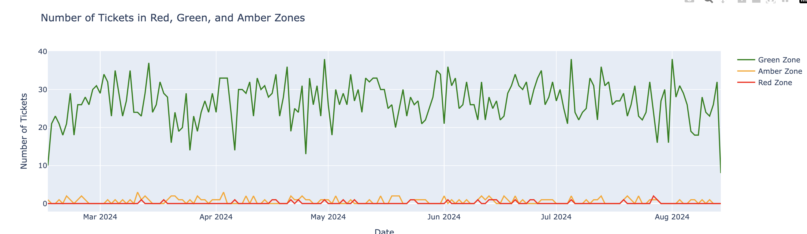

### observations

- well crafted visuals
- very useful and intuitive time filter (slider) on the bottom
- highlighting the appropriate metrics, avg wait time, and the absolute number of tickets, split by wait time.

### possible next steps

#### details

- consider removing the month filter at the top - its functionality is already covered by the slider, and the two filters are disconnected.
    - if we remove it, the interface will become simpler, which increases its value
- annotation and definitions
    - somewhere on the screen, company size "Large" and "Small" should be defined. it's less important where exactly we put the definition.
    - Green, Amber, Red categories, also need to be defined. 
- nitpicks:
    - more descriptive dashboard title, something like "Support Wait Times"
    - 1st plot title: instead of "Average Wait Time Over Time" -> "Average Daily Wait Time"
    - x axis (in both plots) does not need a title

#### reimagining

here is the current Green Amber Red visual

- problem: the amber and the red, are too far away from the green (in reality this is good because we don't have that many people waiting a super long time, relative to the number of people waiting a fair amount of time) but visually, as a dashboard piece, it doesn't look right.

**ideas**:

1. in absolute terms (in terms of raw numbers) green amber red are too distant. so rather than showing absolute terms, show relative terms. show % of green amber red per day. 

there's different ways to show % of green amber red per day:

stacked bar chart
stacked area chart
green dot, amber dot, red dot

**or**: just show % of non-green per day. or absolute number of amber/red per day.

we should prefer absolute numbers in this case, because the % is hard to interpret without knowing the total number of tickets each day.

**conclusion**: absolute number of amber/red per day.

